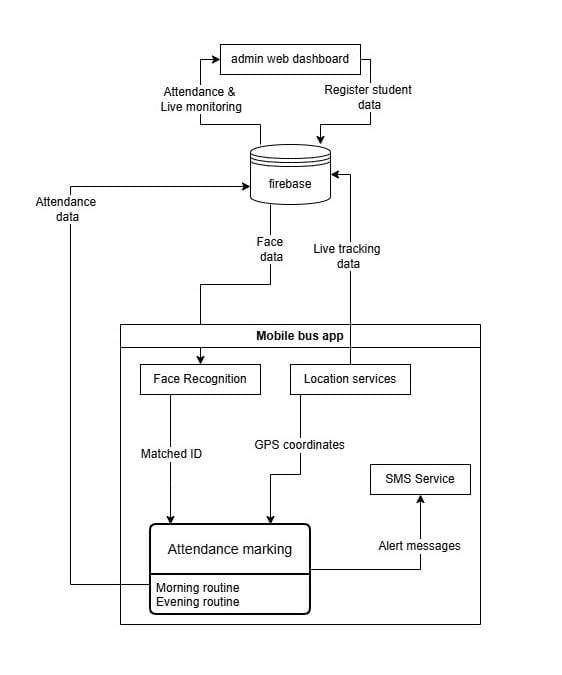
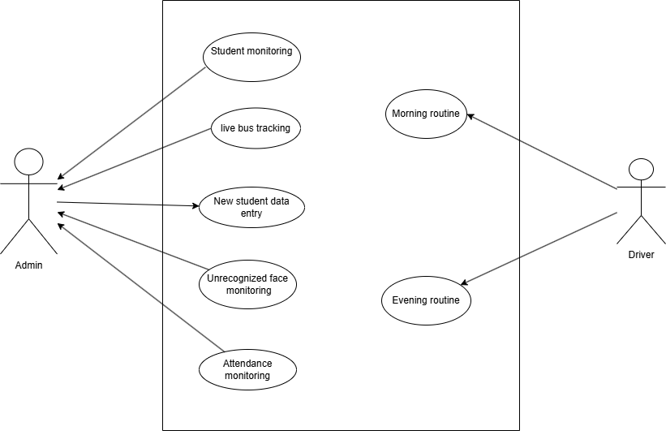
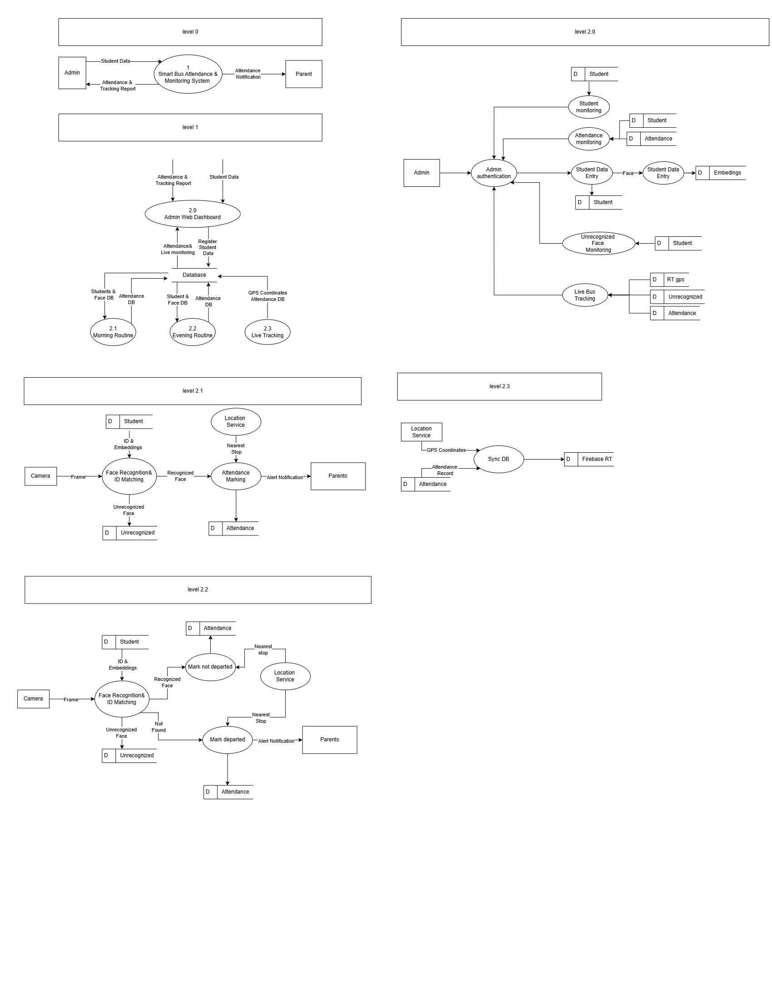
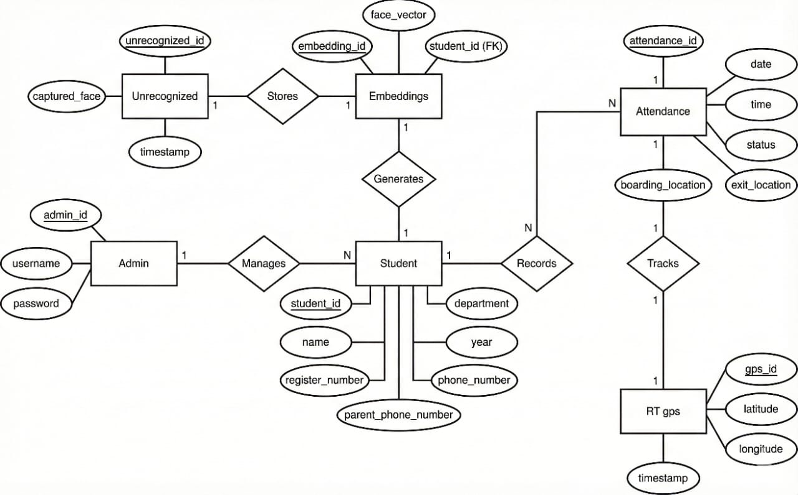
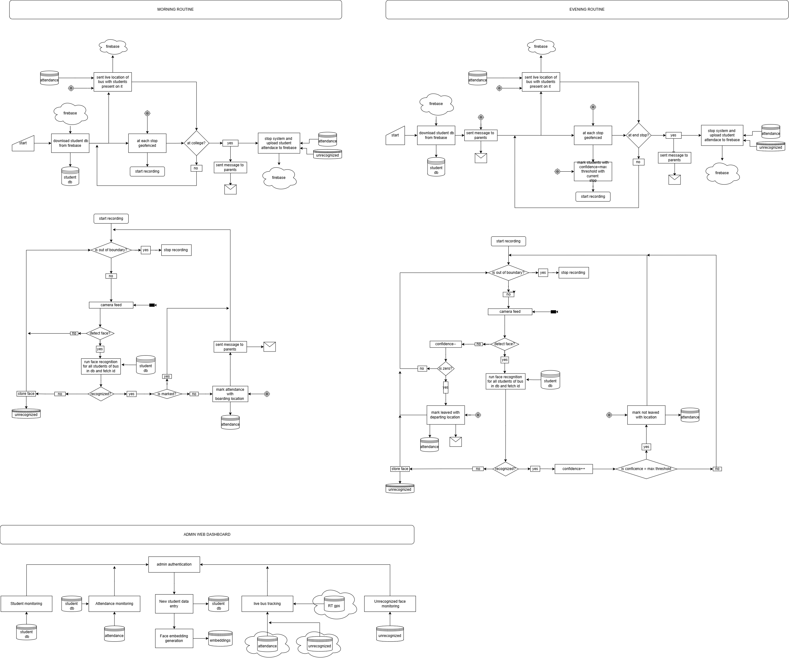
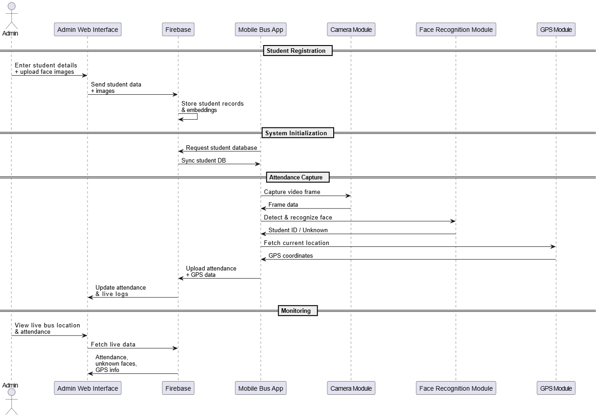

# Smart Bus Tracking and Monitoring System
<!-- ALL-CONTRIBUTORS-BADGE:START - Do not remove or modify this section -->
[](#contributors-)
<!-- ALL-CONTRIBUTORS-BADGE:END -->

A college bus surveillance and attendance system that uses the driver's smartphone for face recognition, GPS tracking, and cloud-backed records. The admin web dashboard lets staff manage buses, students, drivers, routes, fees, and attendance in one place.

**Repository:** [github.com/Dadeathmag/Smart-Bus-Tracking-and-Monitoring-System](https://github.com/Dadeathmag/Smart-Bus-Tracking-and-Monitoring-System)

<p align="center">
  
</p>

## Overview

Manual roll calls and paper logs are slow and error-prone. This project automates bus attendance by recognizing students onboard (via a mobile app) and logging boarding and departure events with real-time location data. A Flask admin portal connects to Firebase for authentication, Firestore data, and Realtime Database tracking.

## Project status

| Component | Status | Notes |
|-----------|--------|--------|
| Admin web (`admin_web/`) | **Completed** | Flask dashboard, Firebase auth, buses, students, drivers, attendance, fees |
| Design & documentation | **Completed** | Diagrams, LaTeX/PDF docs, `docs/images/`, `final/` deliverables |
| Database (Firebase) | **Completed** | Firestore + Realtime Database schema and integration |
| Flutter mobile app | **To be updated** | Driver face recognition & GPS app — planned, not in this repo yet |

## Features

### Admin web (`admin_web/`)

- **Authentication** — Firebase email/password login with role-based redirects (admin / user)
- **Dashboard** — Bus and student counts, daily attendance summary, college location
- **Bus management** — Add buses, assign drivers, define pickup/drop routes, live tracking API
- **Student management** — Register students and parents, upload face photos, bus assignment, fee records
- **Driver management** — Create driver accounts with Firebase custom claims
- **Attendance** — View attendance by date
- **Fees** — Scheduled fee generation (January and July) via APScheduler
- **Settings** — Configure college GPS coordinates

### Project documentation

| Folder | Contents |
|--------|----------|
| `abstract/` | Project abstract (LaTeX + PDF) |
| `design/` | System design diagrams, DFD, ER, architecture (LaTeX + PDF) |
| `litreature review/` | Literature review (LaTeX + PDF) |
| `zeroth review/` | Zeroth review presentation (LaTeX + PDF) |
| `final/` | Final submission deliverables (group report + presentation) |

### Final deliverables (`final/`)

| File | Description |
|------|-------------|
| [`group_report.pdf`](final/group_report.pdf) | Complete group project report |
| [`pres_final.pdf`](final/pres_final.pdf) | Final presentation slides |

## Tech stack

| Layer | Technology |
|-------|------------|
| Admin backend | Python 3.10+, Flask |
| Database | Firebase Firestore, Realtime Database |
| Auth | Firebase Authentication (session cookies) |
| Face recognition (mobile) | TensorFlow Lite, MediaPipe, OpenCV |
| Mobile app | Flutter *(to be updated — not included in repository yet)* |

## System design

High-level diagrams for the Smart Bus Tracking and Monitoring System. Source files also live under `design/design_raw/` and `design/latex/`.

### Use case diagram

<p align="center">
  
</p>

### Data flow diagram (DFD)

<p align="center">
  
</p>

### ER diagram

<p align="center">
  
</p>

### System flowchart

<p align="center">
  
</p>

### Sequence diagram

<p align="center">
  
</p>

## Project structure

```
project/
├── docs/
│   └── images/             # README diagrams (architecture, DFD, ER, etc.)
├── admin_web/              # Flask admin portal
│   ├── app.py              # Application entry point
│   ├── firebase_init.py    # Firebase Admin SDK setup
│   ├── env_config.py       # Environment variable loader
│   ├── routes/             # API and page routes
│   ├── services/           # Business logic
│   ├── templates/          # HTML templates
│   ├── static/             # CSS and uploaded images
│   ├── models/             # ML models (e.g. mobile_face_net.tflite)
│   ├── .env.example        # Environment template
│   └── serviceKey.json.example
├── abstract/
├── design/
├── final/                  # Final report and presentation (PDF)
│   ├── group_report.pdf
│   └── pres_final.pdf
├── litreature review/
└── zeroth review/
```

## Prerequisites

- Python 3.10 or newer
- A [Firebase](https://console.firebase.google.com) project with:
  - Authentication (Email/Password enabled)
  - Cloud Firestore
  - Realtime Database
  - A Web app (for client config)
  - A service account JSON key (Admin SDK)

## Setup

### 1. Clone the repository

```bash
git clone https://github.com/Dadeathmag/Smart-Bus-Tracking-and-Monitoring-System.git
cd Smart-Bus-Tracking-and-Monitoring-System/admin_web
```

### 2. Create a virtual environment

```powershell
python -m venv venv
.\venv\Scripts\Activate.ps1
pip install -r requirements.txt
```

### 3. Configure Firebase credentials

**Do not commit secrets.** The repo ignores `serviceKey.json` and `.env`.

1. Copy the environment template:

   ```powershell
   copy .env.example .env
   ```

2. Fill in `.env` with values from Firebase Console → **Project settings**:
   - **Service accounts** → Generate new private key → save as `serviceKey.json` in `admin_web/`
   - **Your apps** → Web app → copy `apiKey`, `authDomain`, `projectId`, `appId`
   - **Realtime Database** → copy the database URL

3. See `serviceKey.json.example` for the expected JSON shape.

### 4. Assign admin roles

After creating a user in Firebase Authentication, set their role:

```powershell
python set_roles.py <USER_UID> admin
```

Get the UID from Firebase Console → Authentication → Users.

### 5. Run the admin portal

```powershell
python app.py
```

Open [http://127.0.0.1:5000](http://127.0.0.1:5000) and sign in with an admin account.

## Environment variables

| Variable | Description |
|----------|-------------|
| `FIREBASE_SERVICE_ACCOUNT_PATH` | Path to Firebase Admin SDK JSON (default: `serviceKey.json`) |
| `FIREBASE_DATABASE_URL` | Firebase Realtime Database URL |
| `FIREBASE_API_KEY` | Web client API key (login page) |
| `FIREBASE_AUTH_DOMAIN` | e.g. `your-project.firebaseapp.com` |
| `FIREBASE_PROJECT_ID` | Firebase project ID |
| `FIREBASE_APP_ID` | Firebase web app ID |

## Security

- Never commit `serviceKey.json`, `.env`, or `venv/`
- Rotate service account keys if they were ever exposed
- Use HTTPS in production and set `secure=True` on session cookies in `auth_routes.py`
- Firebase web API keys are client-side identifiers; restrict usage in Firebase Console (authorized domains, API restrictions)

## License

This project is licensed under the [MIT License](LICENSE).

## Contributors

Group 6 — Smart Bus Tracking and Monitoring System (see `abstract/main.tex` for team details).
<!-- ALL-CONTRIBUTORS-LIST:START - Do not remove or modify this section -->
<!-- prettier-ignore-start -->
<!-- markdownlint-disable -->
<table>
  <tbody>
    <tr>
      <td align="center" valign="top" width="14.28%"><a href="https://github.com/Dadeathmag"><br /><sub><b>Dadeathmag</b></sub></a><br /><a href="#design-Dadeathmag" title="Design">🎨</a> <a href="https://github.com/Dadeathmag/Smart-Bus-Tracking-and-Monitoring-System/commits?author=Dadeathmag" title="Documentation">📖</a> <a href="#data-Dadeathmag" title="Data">🔣</a> <a href="#infra-Dadeathmag" title="Infrastructure (Hosting, Build-Tools, etc)">🚇</a></td>
      <td align="center" valign="top" width="14.28%"><a href="https://github.com/Akashvg2005"><br /><sub><b>Akash V G</b></sub></a><br /><a href="https://github.com/Dadeathmag/Smart-Bus-Tracking-and-Monitoring-System/commits?author=Akashvg2005" title="Documentation">📖</a></td>
      <td align="center" valign="top" width="14.28%"><a href="https://github.com/Nithya-Manoj"><br /><sub><b>Nithya-Manoj</b></sub></a><br /><a href="https://github.com/Dadeathmag/Smart-Bus-Tracking-and-Monitoring-System/commits?author=Nithya-Manoj" title="Documentation">📖</a></td>
      <td align="center" valign="top" width="14.28%"><a href="https://github.com/Fidha-ifi"><br /><sub><b>Fidha Fathima A </b></sub></a><br /><a href="https://github.com/Dadeathmag/Smart-Bus-Tracking-and-Monitoring-System/commits?author=Fidha-ifi" title="Documentation">📖</a></td>
    </tr>
  </tbody>
</table>

<!-- markdownlint-restore -->
<!-- prettier-ignore-end -->

<!-- ALL-CONTRIBUTORS-LIST:END -->
